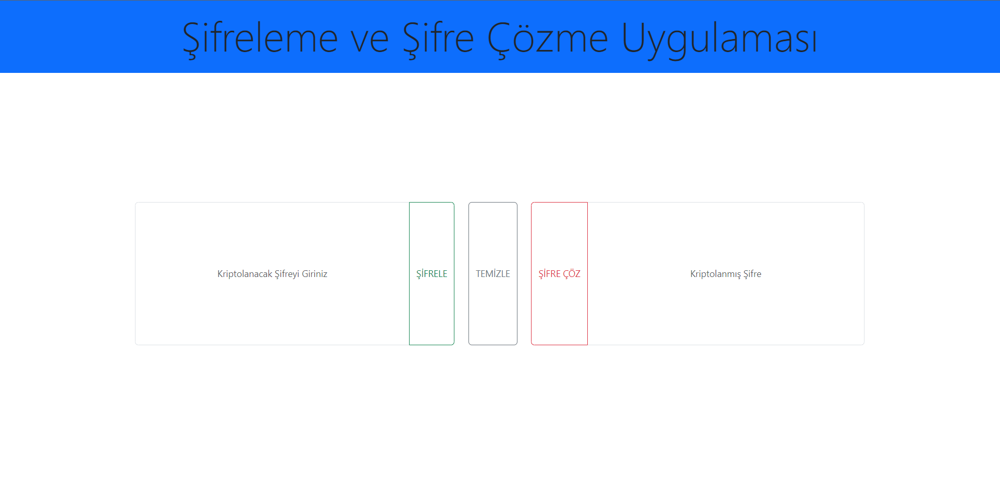
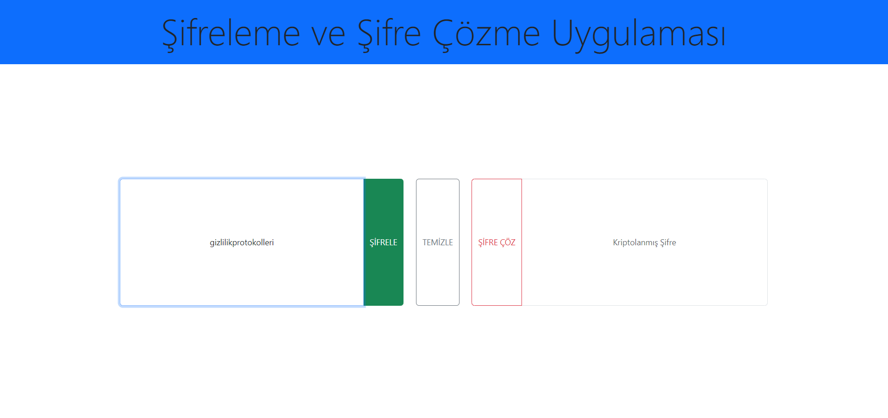
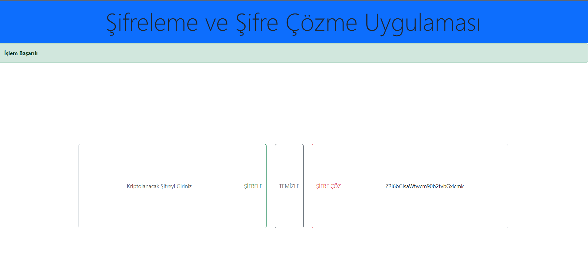
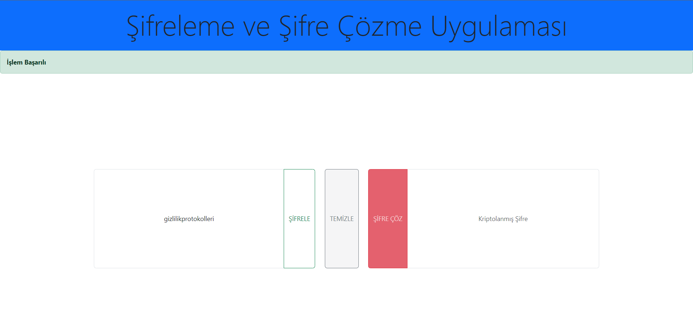
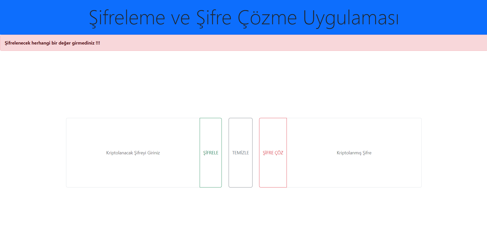

# Sifreleme-Uygulamasi
Kullanıcı dostu bir arayüzle veri şifreleme işlemleri yapabileceğiniz bir uygulama.

## Nasıl Kullanılır
1. **Şifreleme**: "Kriptolanacak Şifreyi Giriniz" alanına bir kelime veya cümle yazın ve "SIFRELE" butonuna tıklayın. 
2. **Şifre Çözme**: "Kriptolanmış Şifre" alanına şifrelenmiş veriyi yazın ve "Şifre Çöz" butonuna tıklayın.
3. **Temizle**: Giriş alanlarını temizlemek için "TEMİZLE" butonuna basın.

## Kullanılan Teknolojiler
- HTML
- Bootstrap
- JavaScript

